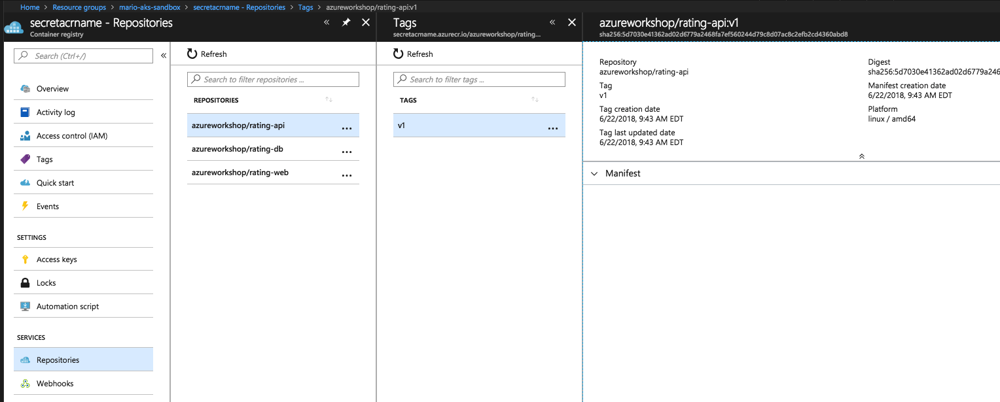

# Azure Container Registry (ACR)

In the [previous section](02-dockerize-apps.md), we built Docker container images for our application components, we need to store them in a secure, central location. In this lab we will use [Azure Container Registry](https://azure.microsoft.com/en-us/services/container-registry/) for this.

## Create Azure Container Registry instance

Creating an ACR instance is very simple. You can accomplish this via the Azure Portal or from the command line. We'll be using the AZ CLI.

1. Login to Azure if you aren't already logged in:

    ```bash
    $ az login
    ```

2. Once logged in to Azure with the AZ CLI, you're now ready to create an ACR instance. For the ACR instance name, please use your name in the form "first initial last name" followed by the "acr" suffix. For example, `mvargasacr`. This ACR instance will be using the Basic tier and be located in East US. Note we're creating it in our resource group named `cbus-aks-training`.

    ```bash
    $ az acr create --name <your-acr-name> \
        --resource-group cbus-aks-training \
        --location eastus --sku Basic
    ```

    Once the ACR instance is created, information about the ACR will be returned in JSON format. This contains valuable details, such as the login server name. Below is an example output:

    ```json
    {
        "adminUserEnabled": false,
        "creationDate": "2018-07-17T13:29:27.296322+00:00",
        "id": "/subscriptions/xxxxxxxx-xxxx-xxxx-xxxx-xxxxxxxxxxxx/resourceGroups/cbus-aks-training/providers/Microsoft.ContainerRegistry/registries/mvargasacr",
        "location": "eastus",
        "loginServer": "mvargasacr.azurecr.io",
        "name": "mvargasacr",
        "provisioningState": "Succeeded",
        "resourceGroup": "cbus-aks-training",
        "sku": {
            "name": "Basic",
            "tier": "Basic"
        },
        "status": null,
        "storageAccount": null,
        "tags": {},
        "type": "Microsoft.ContainerRegistry/registries"
    }    
    ```

3. Next, we need to enable Admin access to our ACR instance. This will allow us to retrieve the ACR credentials via the command line. In the output JSON, verify that the `adminUserEnabled` property is set to `true`. You should reset this value to `false` later.

    ```bash
    $ az acr update -n <your-acr-name> --admin-enabled true
    ```

## Login to your ACR with Docker

Now, in order for us to push our Docker images to ACR, we need to be able to login to ACR with Docker. You can achieve this by going to the Azure Container Registry in the Azure Portal, but we'll opt to accomplish this with the AZ CLI.

1. Show the ACR credentials. The AZ CLI will return them in JSON format. Note that the username is the same as your ACR name. The AZ ACR command will display two passwords. You can use either one.

    ```bash
    $ az acr credential show --name <your-acr-name> --resource-group cbus-aks-training

    {
    "passwords": [
        {
        "name": "password",
        "value": "Supersecret+base64String"
        },
        {
        "name": "password2",
        "value": "Supersecret=base64String"
        }
    ],
    "username": "mvargasacr"
    }

    ```
4. In the terminal session, set each value to a variable as shown below. Your ACR name will probably be different, depending on which name you used above to create it. We'll be using `mvargasacr` in this example:

    ```bash
    $ ACR_SERVER=mvargasacr.azurecr.io
    $ ACR_USER=mvargasacr
    $ ACR_PASSWORD=Supersecret+base64String

    $ docker login --username $ACR_USER --password $ACR_PASSWORD $ACR_SERVER

    # Output from the above command. Ignore the warning shown
    WARNING! Using --password via the CLI is insecure. Use --password-stdin.
    Login Succeeded
    ```

## Tag images with ACR server and repository 

In the same terminal session, since we stored the ACR login server in the environment variable `ACR_SERVER`, enter the following. The name `azureworkshop` is arbitrary.

```bash
$ docker tag rating-db $ACR_SERVER/azureworkshop/rating-db:v1

$ docker tag rating-api $ACR_SERVER/azureworkshop/rating-api:v1

$ docker tag rating-web $ACR_SERVER/azureworkshop/rating-web:v1
```

## Push images to registry

In the same terminal sessions, let's push our Docker images to ACR.

```bash
$ docker push $ACR_SERVER/azureworkshop/rating-db:v1

$ docker push $ACR_SERVER/azureworkshop/rating-api:v1

$ docker push $ACR_SERVER/azureworkshop/rating-web:v1
```

Output from a successful `docker push` command is similar to:

```
The push refers to a repository [mvargasacr.azurecr.io/azureworkshop/rating-db]
035c23fa7393: Pushed
9c2d2977a0f4: Pushed
d7b18f71e002: Pushed
ec41608c0258: Pushed
ea882d709aca: Pushed
74bae5e77d80: Pushed
9cc75948c0bd: Pushed
fc8be3acfc2d: Pushed
f2749fe0b821: Pushed
ddad740d98a1: Pushed
eb228bcf2537: Pushed
dbc5f877c367: Pushed
cfce7a8ae632: Pushed
v1: digest: sha256:f84eba148dfe244f8f8ad0d4ea57ebf82b6ff41f27a903cbb7e3fbe377bb290a size: 3028
```

## Validate images in Azure

There are two ways to validate that the images are indeed in Azure. You can verify their creation from within the Azure Portal (Resource Groups > cbus-aks-training > your-acr-name > repositories, and then click on each repository). An example screen shot is shown below. However, the cool kids prefer the AZ CLI. Let's do that.

1. List out repositories in ACR:

    ```bash
    $ az acr repository list --resource-group cbus-aks-training \
        --name <your-acr-name> --output table

    Result
    ------------------------
    azureworkshop/rating-api
    azureworkshop/rating-db
    azureworkshop/rating-web
    ```

2. Pick one of the above repositories. Let's list out the tags it has. For example, we're going to list the tags associated with the `azureworkshop/rating-api` repository:

    ```bash
    $ az acr repository show-tags -g cbus-aks-training \
        -n <your-acr-name> --repository azureworkshop/rating-api \
        -o table

    Result
    --------
    v1
    ```

## Viewing Docker repositories in Azure Container Registry


